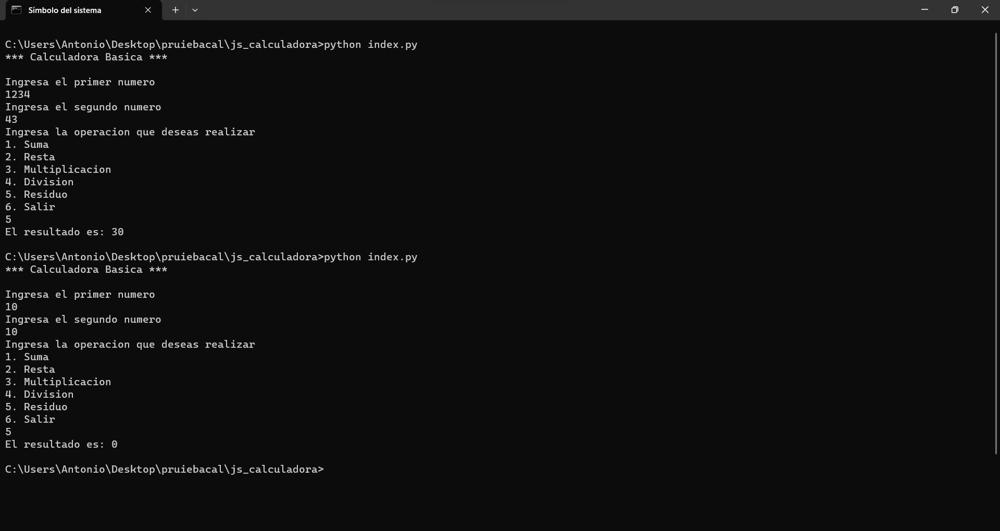

# Calculadora Basica con python

## Integrantes

- EDUARDO ESPIRITU LOPEZ

- EDGAR JESUS MANCILLA LARA

- ANTONIO GALVAN ROJAS

## Descripcion del programa

El programa es una calculadora basica que realiza las operaciones basicas de suma, resta, multiplicacion, division y raiz cuadrada, ademas de que cuenta con una opcion para salir del programa.

## Como compilar y ejecutar el programa

### Clonacion del repositorio

Para clonar el repositorio se necesita tener instalado git en la computadora, despues de eso se necesita abrir la terminal y dirigirse a la carpeta donde se desea clonar el repositorio, despues de eso se escribe el siguiente comando:

```bash
git clone https://github.com/Eduardoespl/js_calculadora.git
```

### Compilacion y ejecucion del programa

Para compilar el programa se necesita tener instalado python en la computadora, despues de eso se necesita abrir la terminal y dirigirse a la carpeta donde se encuentra el programa, despues de eso se escribe el siguiente comando:

```bash
python calculadora.py
```

## Capturas de pantalla

captura de pantalla programa corriendo

